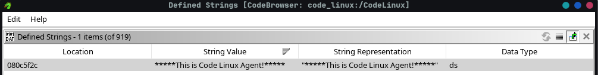
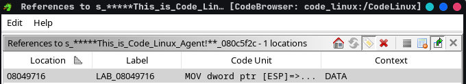

# [code_linux](https://crackmes.one/crackme/5ab77f5f33c5d40ad448c800) — crackme.one

| | |
|---|---|
| **Author** | buga0205 |
| **Language** | C/C++ |
| **Arch** | x86 |
| **Platform** | Linux |
| **Objective** | find the code |

---

## 1. Reconnaissance

Running the binary to observe its behavior:

```text
$ ./CodeLinux
*****This is Code Linux Agent!*****
- Enter The Code : test

Alert! Unidentified User!
```

Gathering basic information:

```text

file :
CodeLinux: ELF 32-bit LSB executable, Intel i386, version 1 (SYSV), statically linked, for GNU/Linux 2.6.24, BuildID[sha1]=376948265d10e5cd1e83dde2f0bf198687c61317, stripped


[*] 'CodeLinux'
    Arch:       i386-32-little
    RELRO:      Partial RELRO
    Stack:      No canary found
    NX:         NX enabled
    PIE:        No PIE (0x8048000)

$ ./strings_filter.py CodeLinux
*****This is Code Linux Agent!*****
- Enter The Code :
Alert!  User!
Alert! I hate debugging stuff,,,\n
Alert! Unidentified User!
You Are Not Code Linux Member!
You are a Code Linux Memeber!!
```

Key takeaways from recon:
- **32-bit (i386)** ELF.
- **No PIE** → base address fixed at 0x8048000, addresses not randomized at runtime (simplifies static analysis and later scripting).
- **Stripped** → no symbol names; every function shows up as `FUN_xxx`.
- **Statically linked** → libc code is embedded in the binary, and being stripped too, libc functions are *also* unnamed — the main challenge will be telling the binary's own logic apart from libc noise.
- **NX enabled / No canary / Partial RELRO** → not relevant for a keygen-style crackme, but noted.
- **Strings** reveal both success and failure messages (`You are a Code Linux Memeber!!` / `You Are Not...`) and a likely anti-debug hint (`Alert! I hate debugging stuff`). The success/failure strings give me anchor points to trace back to the validation logic.

raw strings output was noisy given the static linking, so I filtered it with a small script ([strings_filter.py](../../tools/strings_filter.py)) to surface the meaningful messages.


This hint, combined with the static + stripped nature, tells me I'll get far with static analysis but will eventually need dynamic analysis to confirm the logic — and the anti-debug will have to be dealt with before I can run the binary under a debugger.

---

## 2. Static Analysis (Ghidra)

### 2.1 Find the Main in a stripped binary

we have two options to retrieve the main : 
- we can use the found strings and go up the xref to retrieve the function who use them
- we can take the entry function to retrieve the begining function so the main

#### First Choice




This reference lead to the function : **FUN_080496cc**

#### Second Choice

```c
void processEntry entry(undefined4 param_1,undefined4 param_2)

{
  undefined1 auStack_4 [4];
  
  FUN_08049840(FUN_080496cc,param_2,&stack0x00000004,FUN_08049f20,FUN_08049fc0,param_1,auStack_4);
  do {
                    /* WARNING: Do nothing block with infinite loop */
  } while( true );
}
```
The entry point calls **__libc_start_main**, whose first argument is a pointer to **main**. Here that first argument is **FUN_080496cc** → that's our **main**.

The entry point can always be located regardless of stripping: its address lives in the ELF header (**e_entry field**), not in the symbol table. The loader needs it to start the program, so it's always there — Ghidra reads it and labels it **entry**

Both methods independently converge on **`FUN_080496cc`**, which confirms it's `main`:

- **Entry-point method** (reliable): the entry calls `__libc_start_main`, whose
  first argument is the `main` pointer — deterministic, always works.
- **Strings-xref method** (situational): lands on the function *using* a string,
  usually an internal routine rather than `main` — less useful for finding `main`,
  but great later for jumping straight into the validation logic.

### 2.2 libc vs logic binary code

so our `main` : 

```c
void FUN_080496cc(void)
{
  int iVar1;

  iVar1 = FUN_08075510(0,0,1,0);
  if (iVar1 < 0) {
    FUN_0804fab0("Alert! I hate debugging stuff,,,\\n");
  }
  else {
    FUN_08050120("*****This is Code Linux Agent!*****");
    FUN_0804fab0("- Enter The Code : ");
    FUN_0804fb10(&DAT_080c5f64,&DAT_080f5020);
    FUN_080754c0(1000000);
    iVar1 = FUN_0805c060(&DAT_080f5020);
    DAT_080f3f9c = iVar1 + 1;
    if ((iVar1 + -1) % 2 == 1) {
      FUN_08050120("\nAlert! Unidentified User! ");
      FUN_0804f0d0(1);
    }
    if (0x29 < (DAT_080f3f9c + -9) * 2) {
      FUN_08050120("\nAlert! Unidentified User! ");
      FUN_0804f0d0(1);
    }
    if ((uRam080495ac & 0xff) == 0xcc) {
      FUN_08050120("\nAlert!  User! ");
      FUN_0804f0d0(1);
    }
    FUN_080495a9(&DAT_080f5020);
    FUN_080754c0(500000);
    FUN_08049453(&DAT_080f5020);
    FUN_080495ed(&DAT_080f4fa0);
    FUN_08050120("You Are Not Code Linux Member!");
  }
  return;
}
```

| Ghidra name   | Identified as        | How                                           |
|---------------|----------------------|-----------------------------------------------|
| FUN_08075510  | ptrace               | 4-arg signature + syscall, return-value check |
| FUN_0804fab0  | printf / fputs-like  | format string arg, no `\n` appended           |
| FUN_08050120  | puts                 | single string arg, `\n` appended at runtime   |
| FUN_0804fb10  | scanf-like           | format + destination buffer args              |
| FUN_080754c0  | usleep / delay       | single numeric arg, no side effect on data    |
| FUN_0805c060  | strlen               | single buffer arg, returns length used later  |
| FUN_0804f0d0  | exit                 | single arg, never returns                     |

#### Deep Dive for Ptrace
```c
uint FUN_08075510(int param_1)

{
  uint uVar1;
  int in_GS_OFFSET;
  uint local_10;
  
  uVar1 = (*(code *)PTR_FUN_080f39f0)();
  if (uVar1 < 0xfffff001) {
    if ((-1 < (int)uVar1) && (param_1 - 1U < 3)) {
      *(undefined4 *)(in_GS_OFFSET + -0x18) = 0;
      uVar1 = local_10;
    }
  }
  else {
    *(uint *)(in_GS_OFFSET + -0x18) = -uVar1;
    uVar1 = 0xffffffff;
  }
  return uVar1;
}
```

This function doesn't call a named import — it dispatches through **PTR_FUN_080f39f0**, the indirect syscall gate (the **int 0x80** dispatcher identified earlier). Combined with the errno handling (**in_GS_OFFSET - 0x18**) and the **< 0xfffff001** error check, this is unmistakably a libc syscall wrapper, not application logic. At this point I know it's a syscall wrapper, but not which syscall.

**Verdict: `FUN_08075510` is `ptrace`.** Three independent signals converge:

1. **Internal shape** — dispatches through `PTR_FUN_080f39f0` (the `int 0x80`
   gate) with errno handling via GS → a libc syscall wrapper.
2. **Call site in `main`** — `FUN_08075510(0,0,1,0)` + `if (ret < 0)` → the
   textbook `ptrace(PTRACE_TRACEME, 0, 1, 0)` anti-debug check.
3. **Byte-level proof** — inside the wrapper, just before the gate call:
   `MOV EAX, 0x1a` (syscall 26 = `ptrace` on i386).
```
    08075531 b8 1a 00 00 00    MOV   EAX, 0x1a
    08075536 ff 15 f0 39 0f 08 CALL  dword ptr [->FUN_08076d20]   ; int 0x80 gate
```
The anti-debug logic: `ptrace(PTRACE_TRACEME)` returns -1 if a debugger is
already attached, so `if (ret < 0)` is the trap.

#### Main rename for more clarity
```c
void main(void)

{
  int len;
  
  len = ptrace(0,0,1,0);
  if (len == 0) {
    printf("Alert! I hate debugging stuff,,,\\n");
  }
  
  else {
    puts("*****This is Code Linux Agent!*****");
    printf("- Enter The Code : ");
    scanf(&DAT_080c5f64,&DAT_080f5020);
    usleep(1000000);
    len = strlen(&DAT_080f5020);
    lenPlus1 = len + 1;
    if ((len + -1) % 2 == 1) {
      puts("\nAlert! Unidentified User! ");
      exit(1);
    }
    if (0x29 < (lenPlus1 + -9) * 2) {
      puts("\nAlert! Unidentified User! ");
      exit(1);
    }
    if ((uRam080495ac & 0xff) == 0xcc) {
      puts("\nAlert!  User! ");
      exit(1);
    }
    FUN_080495a9(&DAT_080f5020);
    usleep(500000);
    FUN_08049453(&DAT_080f5020);
    FUN_080495ed(&DAT_080f4fa0);
    puts("You Are Not Code Linux Member!");
  }
  return;
}
```

we have 3 functions left : 
- `FUN_080495a9`
- `FUN_08049453`
- `FUN_080495ed`

there are not compatible with **libc pattern** so this functions are used for the **binary logic**.

### 2.3 Binary logic


The conditions required to succeed:
- `<condition 1>` : <what it means>
- `<condition 2>` : <what it means>

<!-- If there is a transformation (XOR, arithmetic, hashing), explain it here
     and show how to invert it to recover the expected input. -->

---

## 3. Dynamic Analysis (pwndbg)

<!--
Observe the binary at runtime to confirm the static analysis and read real values.
Not always required to solve, but it validates your understanding and reads
runtime-computed values that static analysis cannot give.
TIP: paste the FULL context once, then only the disassembly lines you actually
comment. Dense explanation beats pasting raw output.
-->

<!-- If the binary is PIE, mention it here to explain the 0x5555... addresses. -->

Setting a breakpoint and running with a test input:

```text
pwndbg> break main
pwndbg> run <test_input>
```

Focusing on the registers that matter:

```text
<only the relevant register lines>
```

- `<REG>` : <meaning>

Walking through the key part of the disassembly:

```asm
<only the disassembly lines you comment>
```

- `<addr>` : <what this instruction does, in your own words>
- `<addr>` : <...>

<!-- Highlight the exact instruction that decides success (the cmp / test),
     and read the compared value live. -->

---

## 4. Solution

<!-- The reasoning that leads to a valid input, the input itself, and proof. -->

Reasoning: <why this input satisfies the conditions>

```text
$ ./<binary> <valid_input>
<success output / flag>
```

---

## 5. Conclusion

<!--
What does this crackme teach? Go beyond "I solved it".
Especially: the SECURITY angle. Is the check weak? Why?
This is what shows you think like a vulnerability researcher.
-->

<takeaway: what the design implies, why the check is weak/strong,
 what real-world class of issue it resembles>
